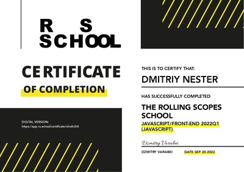
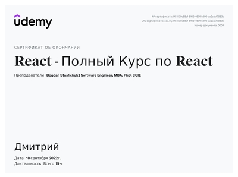

# Dmitriy Nester  [my-website](https://nester-dev.ru/)
## Contacts:
- **Location:** Baranovichi, Belarus
- **Email:** nester-dev@gmail.com
- **GitHub:** [nester-dev](https://github.com/nester-dev)
- **Phone:** +375 (29) 804-38-96
- **Telegram:** @oksanjke

## About Me:
Hello, my name is Dmitriy! I am a frontend developer from Belarus!   
Looking for a great team, where I will be able to realize my potential and apply my skills.   I know how to organize myself well, as well as my workplace. I easily make friends with new people and communicate well with my teammates. I also know how to admit and, of course, correct my mistakes.
Also, I can easily learn and adapt to new tasks. If the project uses a technology that I am not familiar with / poorly familiar with, then I will familiarize myself with it as soon as possible and will be ready to work with it.    At the moment, my main goal is to get a job as a Junior front-end developer. My strengths are purposefulness, perseverance and the desire to progress!

## Skills:
- React Js
- Redux
- TypeScript 
- JavaScript
- HTML5
- CSS3
- Webpack5
- Git/GitHub
- BEM methodology
- Figma

## Courses:

- RSSchool
   - [React JS](https://rs.school/react/)
   - [JavaScript/TypeScript](https://wearecommunity.io/events/js-intro-rss-2022q1)

- Udemy
   - [React JS](https://www.udemy.com/course/react-ru/)
   - [JavaScript](https://www.udemy.com/course/javascript_full/)
   - [HTML/CSS]([website](https://nester-dev.ru/))
   - [Git/GitHub](https://www.udemy.com/course/git-alishev/)

## Certificates:

## Languages: 

- **Russian** - native speaker.
- **English** - A2.
- **Polish** - basic.
